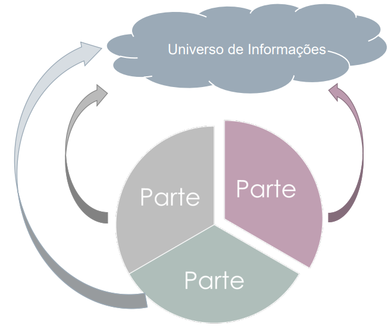

# Identificação De Partes

## <a>Histórico de Versão</a>
|Data|Data Prevista de Revisão|Versão|Descrição|Autor|Revisor|
| :----------: |:-----------:| :------: | :-----------: | :---------: |:---------: |
|07/01/2023|08/01/2023|1.0|Criação do documento| [João Lucas](https://github.com/HacKairos) | [-](https://github.com/) |

## <a>Introdução</a>

Primeiramente, para analisar, é necessário saber como está organizado e armazenado o modelo objeto de nossa análise. Identificar partes do modelo é relevante nesse momento.  
Essa tarefa tem estreita relação com a modelagem e a elicitação, nas quais se torna clara a identificação das fontes de informação. Analisar sistemas complexos inteiros não é uma tarefa sensata. Portanto, particionar essa análise torna-se adequado.  

## <a>Rastreabilidade</a>

No entanto, apenas identificar as partes não é suficiente. Precisamos saber a relação entre essas partes e suas fontes do universo da informação.  É um detalhe da rastreabilidade dos requisitos.   
Uma vez que as partes tenham sido identificadas e as relações entre as partes e as fontes de informação conhecidas, as diretrizes analíticas podem ser estabelecidas. Quais partes são priorizadas, que tipo de escaneamento é usado e se abordagens estatísticas são usadas. A área de teste enfatiza esses aspectos. A maioria dos problemas é encontrada em pequenas partes do sistema.   

## <a>Pré-rastreabilidade</a>
Na figura a seguir uma ilustração do Universo de informações:

 Figura 1 - Universo de informações

Rastrear partes e fontes identificadas é fundamental.

## <a>Bibliografia</a>
SERRANO, Maurício; SERRANO, Milene; Requisitos - Aula 23.