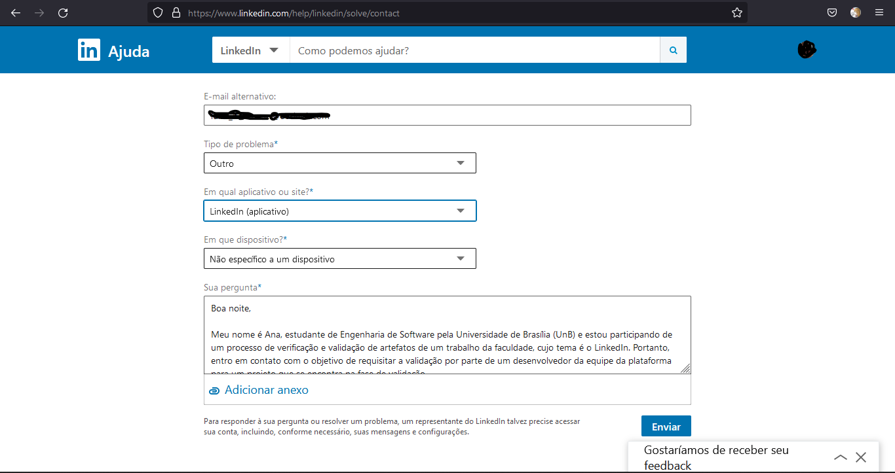

# Validação Informal
## <a>Histórico de Versões</a>
|Data|Data Prevista de Revisão|Versão|Descrição|Autor|Revisor|
| :----------: |:-----------:| :------: | :-----------: | :---------: |:---------: |
|09/01/2023|09/01/2023|1.0|Criação do documento| [Ana Luiza](https://github.com/AnHoff) | [-](https://github.com/) |

## <a>Introdução</a>
Esse documento tem o propósito de apresentar a validação informal e como foi utilizada na validação do trabalho realizado pelo grupo 4, cujo sistema escolhido foi o LinkedIn.

A validação informal consiste em interagir com o usuário para identificar problemas na elaboração dos requisitos. Esse processo permite confirmar se os artefatos elaborados durante o projeto estão alinhados entre si e corretos. Não menos importante, permite também avaliar a correspondência do que foi elaborado com as expectativas do usuário.

O usuário ou cliente, nesse caso, será alguém da equipe de desenvolvimento do próprio LinkedIn. Essa pessoa irá analisar a documentação elaborada e, se possível, irá retornar um feedback elaborado com comparativos com o que foi efetivamente elaborado para o desenvolvimento do LinkedIn.

## <a>Metodologia</a>
Há apenas uma forma de contato direto com o LinkedIn: formulário de contato. Essa forma, a princípio, levará nossa mensagem até alguém responsável por realizar suporte ao usuário. Caso a proposta prossiga para análise, espera-se que algum desenvolvedor entre em contato com atualizações.

Figura 1 - Página de Contato do LinkedIn

## <a>Conclusão</a>
Até hoje (09/01/2023), a mensagem não foi respondida. Qualquer atualização sobre o assunto será registrada nessa conclusão.

## <a>Bibliografia</a>
Projeto Noruh do github de requisitos de software - Planejamento da Verificação - disponível [Aqui](https://requisitos-de-software.github.io/2022.1-Noruh/analise/verificacao/planejamento/), Acesso em: 09 de janeiro de 2023.   
Slides da aula “Requisitos – Aula 20” dos professores Milene Serrano e Maurício Serrano, Acesso em: 09 de janeiro de 2023   
Barbosa, S. D. J.; Silva, B. S. da; Silveira, M. S.; Gasparini, I.; Darin, T.; Barbosa, G. D. J. (2021) _Interação Humano-Computador e Experiência do usuário_. Autopublicação. ISBN: 978-65-00-19677-1. Acesso em: 09 de janeiro de 2023