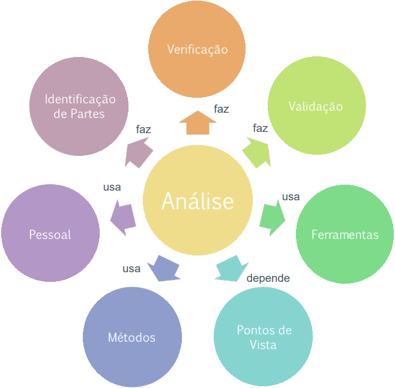

# Análise de Requisitos

## <a>Histórico de Versão</a>
|Data|Data Prevista de Revisão|Versão|Descrição|Autor|Revisor|
| :----------: |:-----------:| :------: | :-----------: | :---------: |:---------: |
|07/01/2023|08/01/2023|1.0|Criação do documento| [João Lucas](https://github.com/HacKairos) | [-](https://github.com/) |

## <a>Introdução</a>
A atividade de análise de requisitos trabalha basicamente na verificação e validação. Só faz sentido analisar algo se tiver uma representação.
  
A seguir uma representação ilustrativa da <a>Análise</a>

 Figura 1 - Análise

## <a>Loop da Análise</a>
A coleta adequada de fatos e a comunicação adequada são essenciais para o sucesso de todos. Isso garante um processo de coleta adequado.  
Observe o loop de análise, A identificação da peça é feita entre o modelo e a comunicação. Se estiver tudo bem, é o modelo no servidor. Caso contrário, precisamos voltar ao universo da informação ou refinar o modelo.

 Figura 2 - Loop da Análise

## <a>Conclusão</a>
A coleta de dados foi fundamental para a atividade de pesquisa, já abordada no início do curso e a comunicação também foi discutida desde o início do curso, influenciando nas atividades de pré-rastreamento, pesquisa e modelagem.

## <a>Bibliografia</a>
SERRANO, Maurício; SERRANO, Milene; Requisitos - Aula 23.