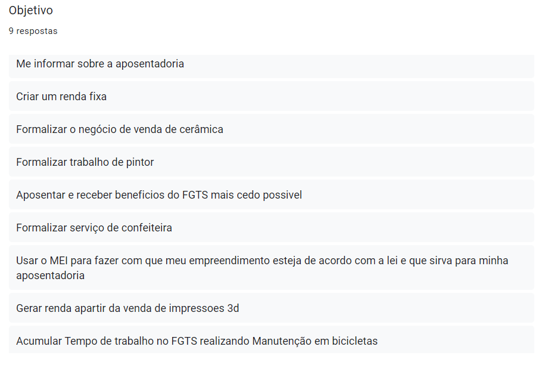

# Perfil do Usuário

## <a>Histórico de Versão</a>
|Data|Data Prevista de Revisão|Versão|Descrição|Autor|Revisor|
| :----------: |:-----------:| :------: | :-----------: | :---------: |:---------: |
|30/11/2022|30/11/2022|1.0|Criação do documento| [Ana Luiza](https://github.com/AnHoff) | [João Lucas](https://github.com/HacKairos) |
|01/12/2022|02/12/2022|1.1|Adiciona dados pesquisa| [Eduardo](https://github.com/edudsan) |[Thiago Oliveira](https://github.com/Thiab394)|

## <a>Introdução</a>

O perfil do usuário deve ser definido levando em conta o maior número possível de tipos de dados a serem coletados. Em outras palavras, um perfil deve possuir informações como, por exemplo:

* Dados demográficos;
* Experiência no assunto;
* Afinidade com tecnologias;
* Tarefas primárias que procura realizar como usuário.

Tendo isto em mente, pode-se utilizar diferentes técnicas para coletar dados sobre o perfil dos usuários. Nesse projeto, foram utilizadas duas técnicas: um questionário em formato de formulário virtual e pesquisa do perfil em cima de estudos realizados previamente por outros analistas, método que complementa e orienta a obtenção de novos dados [1].

## <a>Resultados</a>
Os resultados da pesquisa e do questionário são semelhantes, ou seja, não há grande divergência nos dados obtidos. Alguns dados obtidos pelo questionário são:

1. Escolaridade;
2. Idade;
3. Objetivo;

O questionário também dá suporte às pesquisas realizadas, que nos dizem que, aproximadamente 47% dos usuários são do sexo feminino e que a idade da maior parte dos usuários fica entre 18 e 40 anos. Abaixo há um resumo dos perfis de usuário determinados a partir do uso de ambos os meios.

* Idade: entre 18 e 40 anos;
* Sexo: 55,6 % do sexo masculino e 44,4 % do sexo feminino;
* Status socioeconômico: classe média-baixa;
* Atividades: comércio de vestuário e acessórios, cabelereiros, obras, lanchonetes, atividades relacionadas a beleza, minimercados e amarzéns, bares, entre outros;
* Local de trabalho: grande maioria em casa, seguido de estabelecimento comercial e na rua;
* Experiência: tanto pessoas que já exercem algum trabalho como pessoas que querem iniciar como MEI;
* Dificuldades: encontrar empréstimo ou valor inicial para iniciar as atividades;
* Afinidade com tecnologia: pessoas entre 18 e 30 anos possuem poucos problemas para entender o aplicativo, já as pessoas acima de 30 anos podem ter maiores dificuldades ao utilizá-lo;
* Tecnologia disponível: celular, computador;
* Tarefas do usuário: o sistema deve ser uma forma de ter acesso e formalizar os benefícios como, por exemplo, a aposentadoria;
* Idiomas: português;
* Motivação: o MEI propicia formas de regulamentar um trabalho informal.

A seguir, na figura 1, o gráfico com base nas pesquisas que indicam a relação de sexos dentro do projeto:
 *Figura 1 - Gráfico de dados relacionados ao sexo (Fonte: elaboração própria - Eduardo)*</img>

 

A seguir, na figura 2, os objetivos dos usuários:
 *Figura 2 - Relação dos objetivos dos usuários (Fonte: elaboração própria - Eduardo)*</img>

## <a>Bibliografia</a>
[1] Cooper, Alan, 1952 - About face 3: the essentials of interaction design