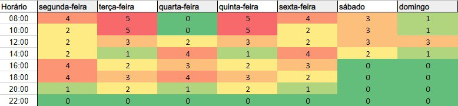

# Heatmap

## <a>Histórico de Versão</a>

|Data|Data Prevista de Revisão|Versão|Descrição|Autor|Revisor|
| :----------: |:----------:| :------: | :-----------: | :---------: |:---------: |
|17/11/2022|18/11/2022|1.0|Criação do Documento de Ferramentas Utilizadas| [Eduardo](https://github.com/edudsan)| [João Lucas](https://github.com/HacKairos)|
|22/11/2022|23/11/2022|1.1|Adição de legendas nas imagens e adção da legenda do heatmap| [Eduardo](https://github.com/edudsan)| [João Lucas](https://github.com/HacKairos)|
|29/11/2022|30/11/2022|1.2|Correção do Historico de versão| [Thiago Olivera](https://github.com/Thiab394)| [João Lucas](https://github.com/HacKairos)|

## <a>Heatmap de quadro de indisponibilidade</a>

Neste documento está apresentado o quadro de indisponibilidade dos integrantes do grupo. Cada membro preencheu uma tabela com seu respectivo nome, e nelas os integrantes deveriam 
preencher o horário em que eles não estariam disponíveis, desse modo, organizar as reuniões com a participação da maioria dos integrantes, como pode ser observado na figura 1.

 Figura 1 - Mapa de calor (Autoria própria - Eduardo)</img>

Onde consta zero na figura acima é quando nenhum dos integrantes está ocupado, onde possui um número maior que zero é a quantidade de integrantes que estão indisponíveis no horário como pode ser observado na figura 2.

 Figura 2 - Legenda Heatmap (Autoria própria - Eduardo)</img>

## <a>Bibliografia</a>
- HEATMAP. Disponível em: https://pt.wikipedia.org/wiki/Mapa_de_calor Acesso em: 30 de novembro de 2022.
