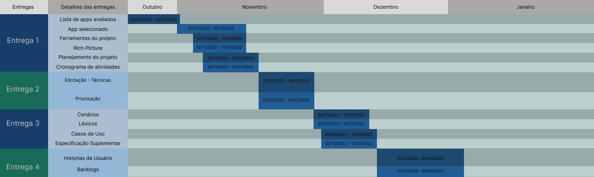

# Roadmap 

## Histórico de Versão

|Data|Versão|Descrição|Autor|Revisão|
| :----------: | :------: | :-----------: | :---------: |:---------: |
|20/11/2022|1.0|Criação do Documento de Metodologia| [Arthur Taylor](https://github.com/Eruel6)|[Thiago Oliveira](https://github.com/Thiab394)

## Roadmap planejado

O roadmap foi planejado seguindo a data e requisitos para entrega das tarefas do projeto, sendo que as datas possuem em geral um prazo um pouco menor 
que o limite para possibilitar possíveis revisões e alterações nos artefatos.

</img>

*Este roadmap é uma versão inicial e pode sofrer alterações*
