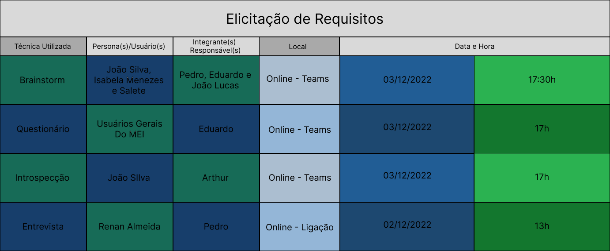

# Cronogramas 

## Histórico de Versão

|Data|Data Prevista de Revisão|Versão|Descrição|Autor|Revisão|
| :----------: | :------: | :------: | :-----------: | :---------: |:---------: |
|29/11/2022|30/11/2022|1.0|Criação dos Cronogramas| [Thiago Oliveira](https://github.com/Thiab394) |[Arthur Taylor](https://github.com/Eruel6)
|29/11/2022|30/11/2022|1.1|Ajuste das Imagens| [Thiago Oliveira](https://github.com/Thiab394) |[João Lucas](https://github.com/HacKairos)
|06/12/2022|07/12/2022|1.2|Adição de Cronogramas Corrigidos e Links de visualização das técnias feitas| [Thiago Oliveira](https://github.com/Thiab394) |[Arthur Taylor](https://github.com/Eruel6)

## Cronograma Planejado - Elicitação

O cronograma foi planejado de acordo com as personas desenvolvidas para o projeto, com o cronograma da disciplina seguindo o que foi pedido para tal cronograma
e com as referencias presentes neste documento, tal cronograma(Figura 1) contem as datas, horários e locais da realização da elicitação dos requisitos para o projeto, com cada
uma das personas presentes e com cada uma das técnicas escolhidas pelo grupo [1], sendo elas: [Brainstorm](https://github.com/Requisitos-de-Software/2022.2-MEI/blob/main/docs/Requisitos/Elicita%C3%A7%C3%A3o/Brainstorming.md),[Questionário](),[Introspecção](https://github.com/Requisitos-de-Software/2022.2-MEI/blob/main/docs/Requisitos/Elicita%C3%A7%C3%A3o/Introspeccao.md) e [Entrevista](https://github.com/Requisitos-de-Software/2022.2-MEI/blob/main/docs/Requisitos/Elicita%C3%A7%C3%A3o/Entrevista.md).

Ilustração do Roadmap na Figura 1 :
Figura 1 - Cronograma de Elicitação</img>

## Cronograma Planejado - Priorização

O cronograma foi planejado de acordo com as personas desenvolvidas para o projeto, com o cronograma da disciplina seguindo o que foi pedido para tal cronograma
e com as referencias presentes neste documento, tal cronograma(Figura 2) contem as datas, horários e locais da realização da Priorização dos requisitos para o projeto, com cada
uma das personas presentes e com cada uma das técnicas escolhidas pelo grupo [2], todas elas estão presentes no documento de [Técnicas de Elicitação](https://github.com/Requisitos-de-Software/2022.2-MEI/blob/main/docs/Requisitos/tecnicas-priorizacao.md).

Ilustração do Roadmap na Figura 2 :
Figura 2 - Cronograma de Priorização</img>

## Bibliografia

[1] BCE Github Interção Humano Computador , disponivel em: https://github.com/Interacao-Humano-Computador/2020.1-BCE Acesso em: 29 de novembro de 2022
[2] Duolingo Github Requisitos de Software, disponivel em: https://github.com/Requisitos-de-Software/2019.2-Duolingo Acesso em: 29 de novembro de 2022