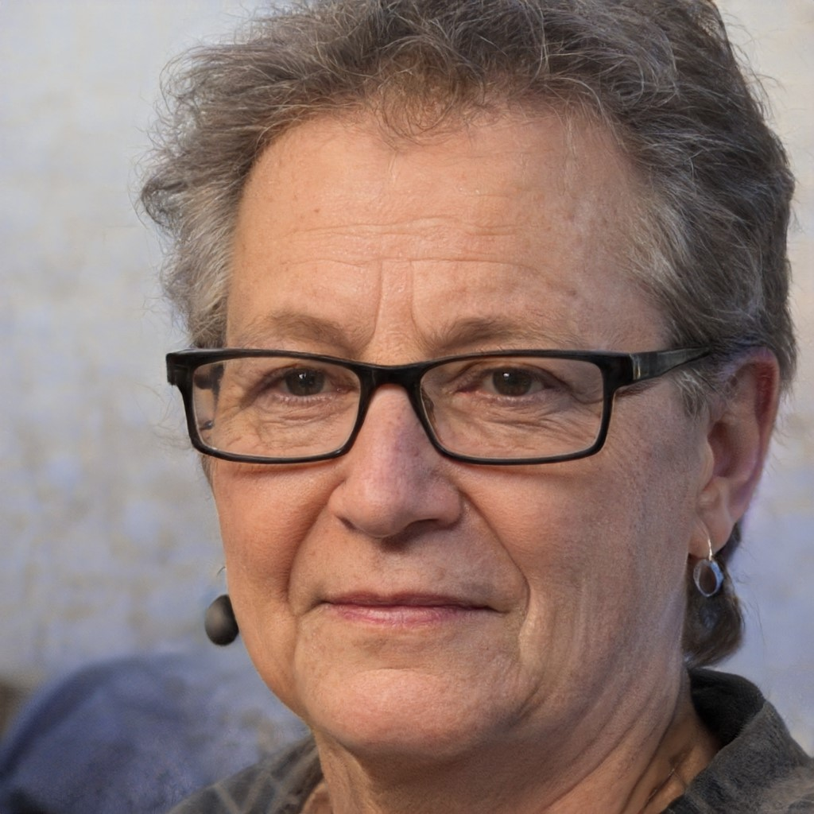

# Personas

## Histórico de Versão
|Data|Data Prevista de Revisão|Versão|Descrição|Autor|Revisor|
| :----------: |:-----------:| :------: | :-----------: | :---------: |:---------: |
|29/11/2022|30/11/2022|1.0|Criação do documento| [Ana Luiza](https://github.com/AnHoff) | [João Lucas](https://github.com/HacKairos) |
|29/11/2022|30/11/2022|1.0|Criação do documento| [Pedro Lucas](https://github.com/PedroLSF) | [João Lucas](https://github.com/HacKairos) |

## Introdução
Economistas criam modelos para representar o comportamento do mercado e o mesmo acontece na área de engenharia de software: engenheiros de requisitos criam personas para descrever os usuários. A criação de personas se provou uma ferramenta extremamente útil para lidar com designs relacionados à interação do usuário com o sistema.

Personas devem ser criadas de modo a satisfazer uma ampla gama de usuários, generalizando suas características de modo a contemplar o maior número possível de usuários identificados.

O objetivo das personas é providenciar de forma precisa o modo como o usuário irá se comportar, o que ele irá pensar e o que ele deseja realizar, assim como os motivos por trás de cada ação. Para tanto, apesar de não serem reais, as personas devem ser baseadas em perfis reais de usuários. Tais perfis podem ser obtidos de diferentes maneiras, com algumas técnicas que serão utilizadas e apresentadas nesse projeto.

## Criação e Contribuição
Como dito previamente, personas devem ser baseadas em perfis reais. Em outras palavras, a eficácia e/ou qualidade de uma persona é diretamente proporcional à qualidade dos dados coletados sobre os usuários reais. Algumas formas de se obter tais dados são listadas abaixo.

* Entrevistas com usuários fora do contexto de uso;
* Informações obtidas diretamente com os stakeholders;
* Pesquisa de mercado e questionários direcionados a grupos de foco;
* Dados obtidos a partir de estudos prévios.

É importante ressaltar que, apesar das formas acima serem fontes válidas de dados, elas não podem tomar o lugar de entrevistas realizadas diretamente com o usuário e de observações. A contribuição que o uso de personas bem produzidas pode trazer para o projeto é vasta, serão citadas aqui algumas mais comuns:

* Ajudam a determinar o que o produto deveria fazer e como ele deveria se comportar em determinadas situações;
* Contribuem na comunicação com os stakeholders, designers e desenvolvedors;
* Promovem consenso com relação ao design e medem sua efetividade;
* Contribuem para diferentes áreas do produto, como, por exemplo, para o marketing.

O perfil de usuário utilizado para a elaboração das personas pode ser encontrado [aqui](perfil.md).

## Escolhas da Persona

O grupo abriu um questionário e levantou ideias com relação ao número ideal de personas. Foram analisadas as respostas do questionário e resultados das buscas sobre dados coletados anteriormente e, por fim, concluiu-se que 3 seria o número ideal para agrupar os usuários do MEI. Pontos levantados para a escolha desse número foram:

* Apesar do MEI aceitar vários tipos de pessoas, as maiores diferenças são com relação ao trabalho realizado.Essas pessoas, apesar de terem atuações diferentes, realizam os mesmos comandos dentro do aplicativo;
* Deve-se escolher um perfil secundário representando usuários que precisam de auxílio para utilizar o MEI;
* As funções do MEI são simples e há poucas opções.

A antipersona por sua vez deveria ser um perfil de usuário que não precisasse do MEI, então ele foi criado com base nos requisitos necessários para ser recusado como MEI, como, por exemplo, renda e serviços prestados.

## Personas Elaboradas

  
### Isabela Menezes
Persona Primária

*Imagem 1 - fonte Random User Generator*

* **Idade**: 22 anos;
* **Sexo**: Feminino;
* **Relacionamentos**: vive com os pais e a vó, possui boas relações com todos ao seu redor;
* **Local de trabalho**: Casa própria;
* **Meios utilizados**: Redes sociais para divulgação;
* **Acesso**: Computador e Celular;
* **Funcionários**: Não Possui;
* **Atividades extra**: Faculdade;
* **Status socioeconômico**: Classe Média;
* **Descrição**: Começou a produzir vestuário e está começando a empreender;
* **Motivação**: Já produzia peças de roupa para si mesma e recebeu indicações para iniciar um trabalho autônomo de confecção e venda de vestuário;
* **Expectativas**: Realizar por meio do aplicativo as etapas necessárias para se regularizar como microempreendedora, sem precisar ir até agências físicas durante o processo;
* **Afinidade com tecnologia**: Média;
* **Experiência prévia**: nenhuma.

  
### João Silva
Persona Primária

*Imagem 2 - fonte Random User Generator*
  

* **Idade**: 35 anos;
* **Sexo**: Masculino;
* **Relacionamentos**: é viúvo e vive apenas com o filho, possui contato distante com vizinhos;
* **Local de trabalho**: Casa Própria;
* **Meios utilizados**: Redes Sociais e site próprio para divulgação e venda;
* **Acesso**: Celular;
* **Funcionários**: Não Possui;
* **Atividades extra**: Cuida de um filho deficiente;
* **Status socioeconômico**: Classe Baixa;
* **Descrição**: Produz cerâmica para ter uma renda;
* **Motivação**: realizou um curso profissionalizante de produção de cerâmica e precisava de uma renda;
* **Expectativas**: Espera evitar ter que sair de casa, resolvendo todas as prestações de contas e acompanhamento de processos a partir do MEI;
* **Afinidade com tecnologia**: Alta;
* **Experiência prévia**: média (utilizou o aplicativo com certa constância antes).

  
### Salete Camargo
Persona Secundária

*Imagem 3 - fonte Random User Generator*
  

* **Idade**: 65 anos;
* **Sexo**: Feminino;
* **Relacionamentos**: é viúva, vive sozinha e não possui muito contato com a família e colegas;
* **Local de trabalho**: Casa Própria;
* **Meios utilizados**: Venda Local;
* **Acesso**: Celular;
* **Funcionários**: Não possui;
* **Atividades extra**: Nenhuma;
* **Status socioeconômico**: Classe Média;
* **Descrição**: Devido a sua idade, não consegue exercer bem os trabalhos que necessitam de esforço fisíco e para se distrair começou a produzir manufaturado;
* **Motivação**: Queria entreter-se no tempo livre e seu hobby virou uma fonte de renda extra;
* **Expectativas**: Deseja se registrar como MEI e obter de primeira mão informações sobre esse processo;
* **Afinidade com tecnologia**: Baixa;
* **Experiência prévia**: nenhuma.

### Valdemar Chess
Antipersona

*Imagem 4 - fonte Random User Generator*

* **Idade**: 54 anos;
* **Sexo**: masculino;
* **Relacionamentos**: é casado, possui uma filha e tem bons relacionamentos em casa e no trabalho;
* **Local de trabalho**: escritório;
* **Meios utilizados**: softwares de documentos;
* **Acesso**: computador e celular;
* **Funcionários**: mais de 100;
* **Atividades extra**: fazer trilhas;
* **Status socioeconômico**: classe alta;
* **Descrição**: é dono de uma rede de escritórios de advocacia, possuindo renda extremamente alta;
* **Motivação**: possui alguns funcionários que trabalham de forma autônoma e, por isso, decidiu aprender sobre o MEI;
* **Expectativas**: achar informações que o torne capaz de indicar o MEI a quem precisa e não conhece o aplicativo;
* **Afinidade com tecnologia**: alta;
* **Experiência prévia**: nenhuma.

## Bibliografia
[1] Cooper, Alan, 1952 - About face 3: the essentials of interaction design

[2] Random User Generator - disponível em https://randomuser.me/