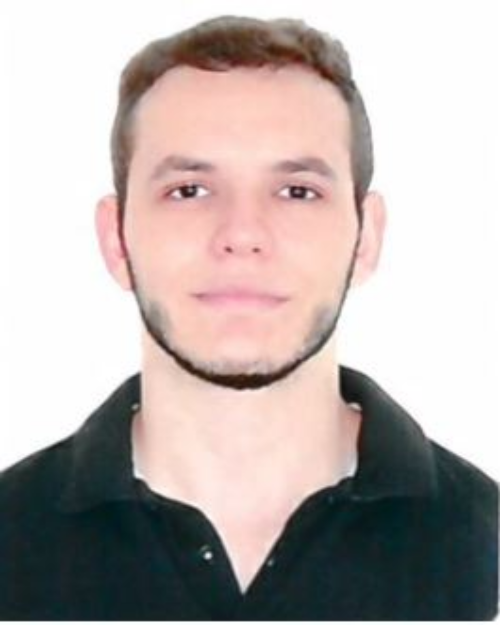
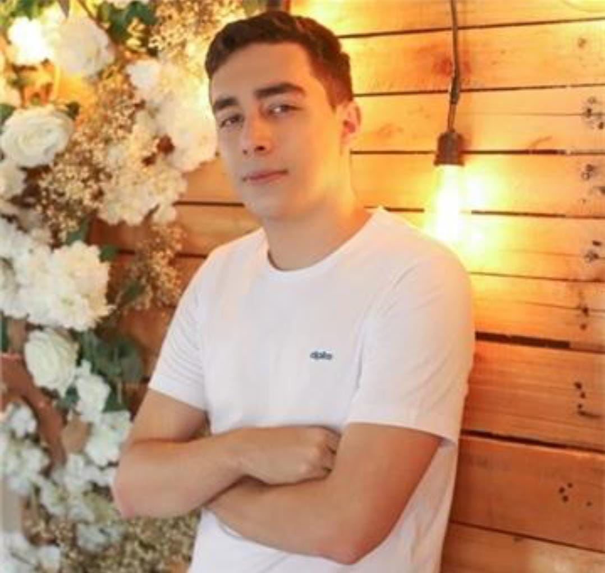

---
hide:
  - navigation

---
# Projeto

<h1>
MEI - Microempreendedor Individual
</h1>

## Sobre o projeto
Este repositório destina-se à matéria de Requisitos de Software da Universidade de Brasília. Possui o objetivo de analisar o aplicativo [MEI](https://play.google.com/store/apps/details?id=br.gov.fazenda.receita.mei&gl=US), aplicando conceitos aprendidos na discplina.

## Equipe
Apresentação da equipe na Tabela 1 :

|Foto | Nome| GitHub| E-mail| 
|:-----:|:-----:|:-----:|:-----:|
|  | Ana Luiza Hoffmann Ferreira | [AnHoff](https://github.com/AnHoff) | ana.hoffmann@aluno.unb.br |
|  | Arthur Taylor de Jesus Popov | [Eruel6](https://github.com/Eruel6) | arthur.popov@aluno.unb.br |
|  | Eduardo Schuindt Santos | [edudsan](https://github.com/edudsan) | eduardo.schuindt@aluno.unb.br |
|  | Joao Lucas Pinto Vasconcelos | [Hackairos](https://github.com/HacKairos) | vasconcelos.joao@aluno.unb.br |
|  | Pedro Lucas Siqueira Fernandes | [PedroLSF](https://github.com/PedroLSF) | fernandes.siqueira@aluno.unb.br |
|  | Thiago Oliveira Cunha | [Thiab394](https://github.com/Thiab394)| thiago.cunha@aluno.unb.br |

*Tabela 1 - Equipe*

## Histórico de Versão
|Data|Data Prevista de Revisão|Versão|Descrição|Autor|Revisor|
| :----------: |:-----------:| :------: | :-----------: | :---------: |:---------: |
|20/11/2022|20/11/2022|1.0|Criação da pagina Home| [Joao Lucas](https://github.com/HacKairos)|[Thiago Olivera](https://github.com/Thiab394)|

